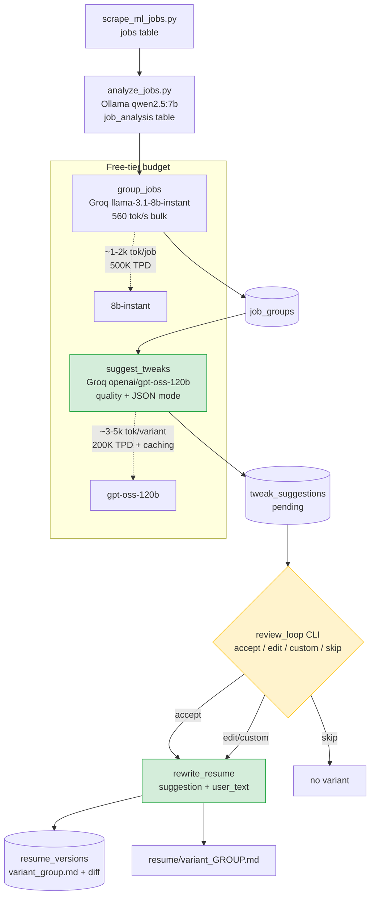
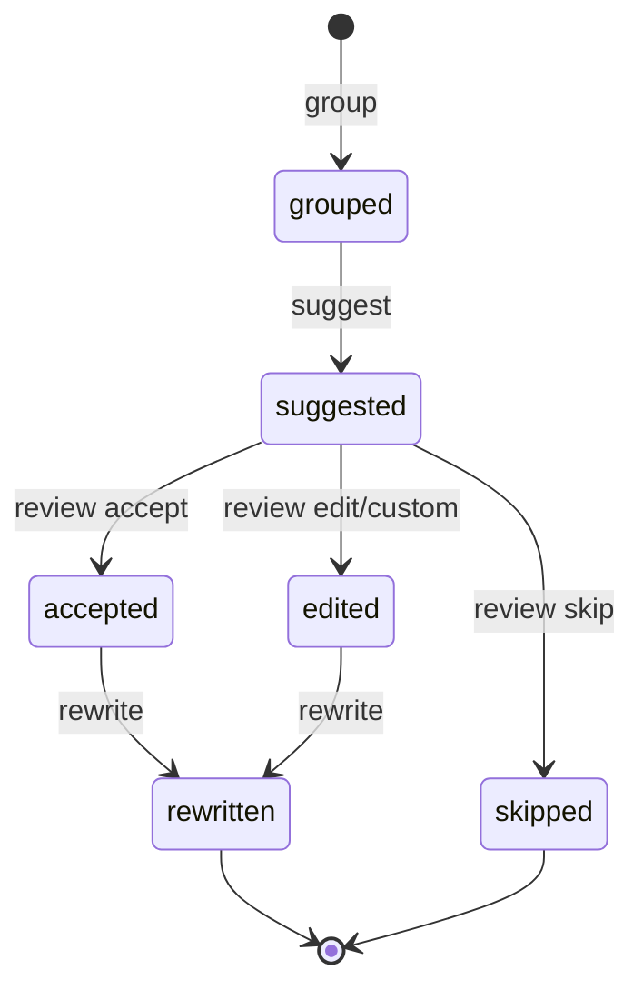
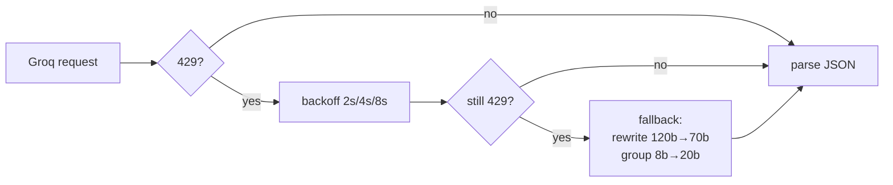

# docs — Resume Tweaker architecture (graphify)

Flow: scrape → analyze (Ollama, local) → group → suggest → human review → rewrite (Groq Cloud).

```mermaid
flowchart TD
    A[scrape_ml_jobs.py<br/>jobs table] --> B[analyze_jobs.py<br/>Ollama qwen2.5:7b<br/>job_analysis table]
    B --> C[group_jobs<br/>Groq llama-3.1-8b-instant<br/>560 tok/s bulk]
    C --> D[(job_groups)]
    D --> E[suggest_tweaks<br/>Groq openai/gpt-oss-120b<br/>quality + JSON mode]
    E --> F[(tweak_suggestions<br/>pending)]
    F --> G{review_loop CLI<br/>accept / edit / custom / skip}
    G -- accept --> H[rewrite_resume<br/>suggestion as-is]
    G -- edit/custom --> H[rewrite_resume<br/>suggestion + user_text]
    G -- skip --> I[no variant]
    H --> J[(resume_versions<br/>variant_group.md + diff)]
    H --> K[resume/variant_GROUP.md]

    subgraph Free-tier budget
      C -.->|~1-2k tok/job<br/>500K TPD| L[8b-instant]
      E -.->|~3-5k tok/variant<br/>200K TPD + caching| M[gpt-oss-120b]
    end

    style E fill:#d4edda,stroke:#28a745
    style H fill:#d4edda,stroke:#28a745
    style G fill:#fff3cd,stroke:#ffc107
```

## State machine (per group)

```mermaid
stateDiagram-v2
    [*] --> grouped: group
    grouped --> suggested: suggest
    suggested --> accepted: review accept
    suggested --> edited: review edit/custom
    suggested --> skipped: review skip
    accepted --> rewritten: rewrite
    edited --> rewritten: rewrite
    rewritten --> [*]
    skipped --> [*]
```

## Model routing

```mermaid
flowchart LR
    REQ[Groq request] --> LIM{429?}
    LIM -- no --> OK[parse JSON]
    LIM -- yes --> BO[backoff 2s/4s/8s]
    BO --> FB{still 429?}
    FB -- no --> OK
    FB -- yes --> FALL[fallback:<br/>rewrite 120b→70b<br/>group 8b→20b]
    FALL --> OK
```
